# Architecture

Internal reference for developers and maintainers of the Linear agent plugin.

---

## System Topology

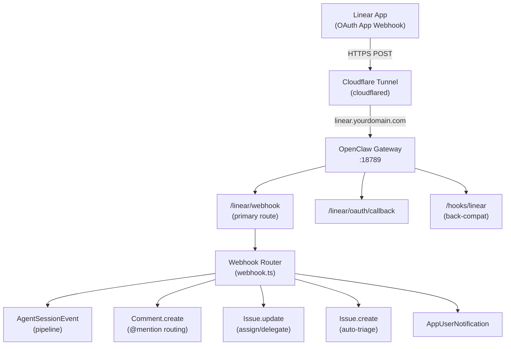

## Webhook Event Types

All events arrive via POST. The router dispatches by `payload.type`:

| Event | Trigger | Handler |
|-------|---------|---------|
| `AgentSessionEvent.created` | Agent session opened in Linear UI | Full dispatch pipeline |
| `AgentSessionEvent.prompted` | User follow-up in existing session | Resume with streaming |
| `Comment.create` | `@mention` in a comment | Route to role-based agent |
| `Issue.create` | New issue created | Auto-triage (estimate, labels, priority) |
| `Issue.update` | Issue assigned/delegated to agent | Dispatch pipeline |
| `AppUserNotification` | Agent mentioned/assigned via OAuth app | Direct response |

All handlers respond `200 OK` within 5 seconds (Linear requirement), then process asynchronously.

**Payload structure differences:**
- Workspace events: `type=Comment action=create`, data at `payload.data`
- OAuth events: `type=AgentSessionEvent action=created`, session at `payload.agentSession`
- Important: `AgentSessionEvent`/`created`, NOT `AgentSession`/`create`

---

## Pipeline Stages

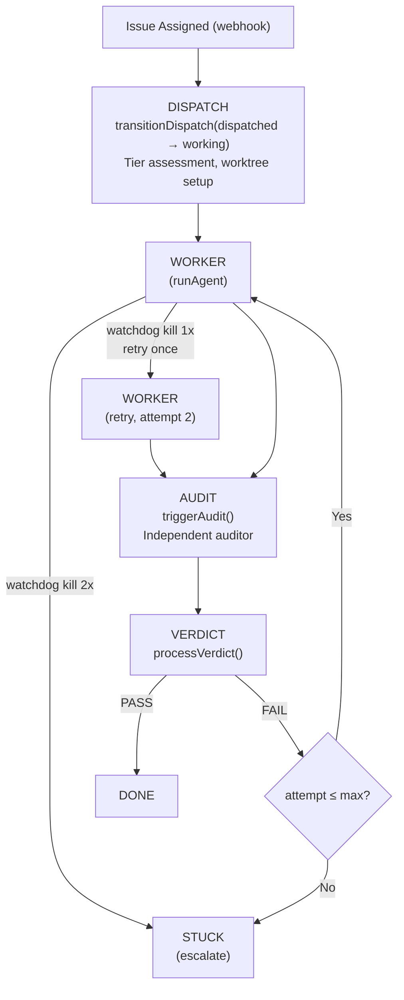

### Worker Phase (`spawnWorker`)

1. Transitions `dispatched -> working` (CAS)
2. Fetches issue details from Linear GraphQL API
3. Builds task prompt from `prompts.yaml` templates
4. Registers session mapping for `agent_end` hook
5. Calls `runAgent()` with streaming callbacks
6. Saves output to `.claw/worker-{N}.md`
7. Appends structured log to `.claw/log.jsonl`
8. If `watchdogKilled`: logs artifact, transitions to `stuck`, sends notification
9. Otherwise: triggers `triggerAudit()`

### Audit Phase (`triggerAudit`)

1. Dedup via `markEventProcessed()`
2. Transitions `working -> auditing` (CAS)
3. Builds audit prompt from `prompts.yaml`
4. Spawns independent auditor via `runAgent()`
5. Passes result to `processVerdict()`

### Verdict Phase (`processVerdict`)

1. Parses JSON verdict: `{"pass": true/false, "criteria": [...], "gaps": [...], "testResults": "..."}`
2. **Pass**: transition to `done`, write summary to `.claw/`, post approval comment
3. **Fail (retries left)**: transition back to `working`, increment attempt, re-spawn worker with gaps
4. **Fail (max reached)**: transition to `stuck`, post escalation comment, notify

---

## Agent Execution (`agent.ts`)

### Embedded Runner (primary)

Uses OpenClaw's `extensionAPI.runEmbeddedPiAgent()` for in-process execution with real-time streaming.

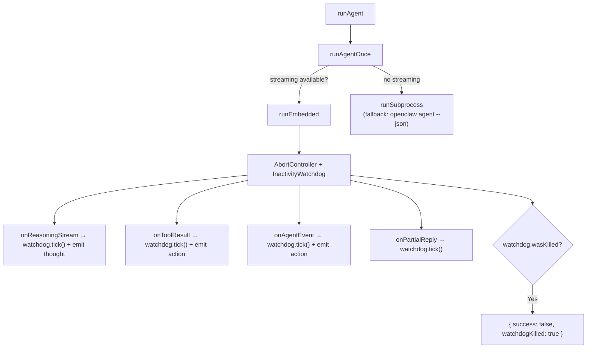

### Retry Wrapper

`runAgent()` wraps `runAgentOnce()` with retry-on-watchdog-kill:

1. First attempt runs normally
2. If `watchdogKilled: true`: log warning, emit Linear activity, retry once
3. Second failure: return as-is (caller handles escalation)
4. Non-watchdog failures: no retry

---

## Inactivity Watchdog (`watchdog.ts`)

### InactivityWatchdog Class

- `start()` -- begin watching (idempotent)
- `tick()` -- reset countdown (`lastActivityAt = Date.now()`)
- `stop()` -- clean shutdown
- `wasKilled` / `silenceMs` -- query state after completion

Timer uses dynamic rescheduling: calculates remaining time from last tick, not fixed polling. Minimum check interval: 1 second.

### Kill Flow

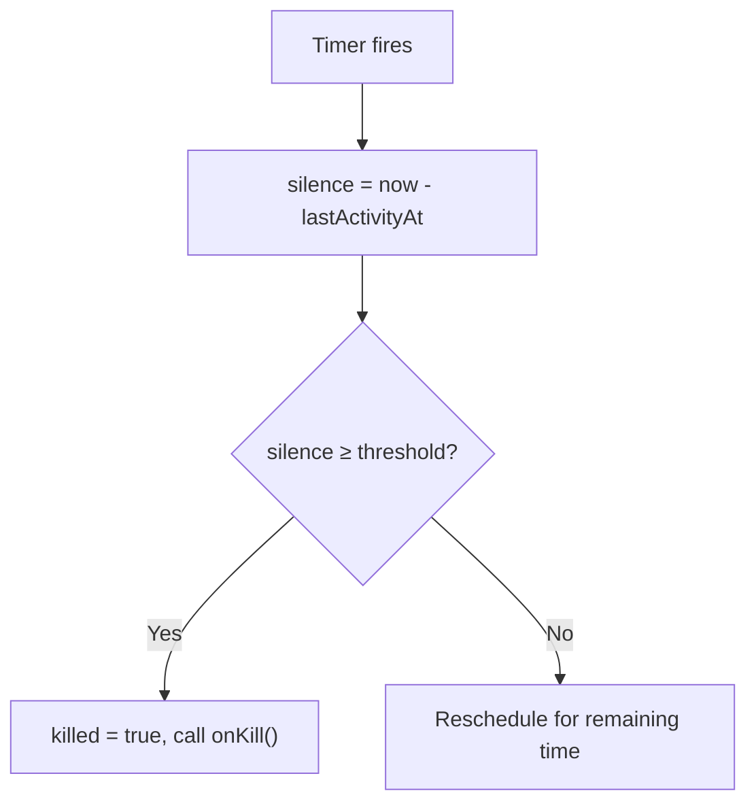

**onKill callback by context:**
- Embedded runner: `controller.abort()` + `ext.abortEmbeddedPiRun(sessionId)`
- CLI tools: `child.kill("SIGTERM")` + 5s `child.kill("SIGKILL")`

### Config Resolution

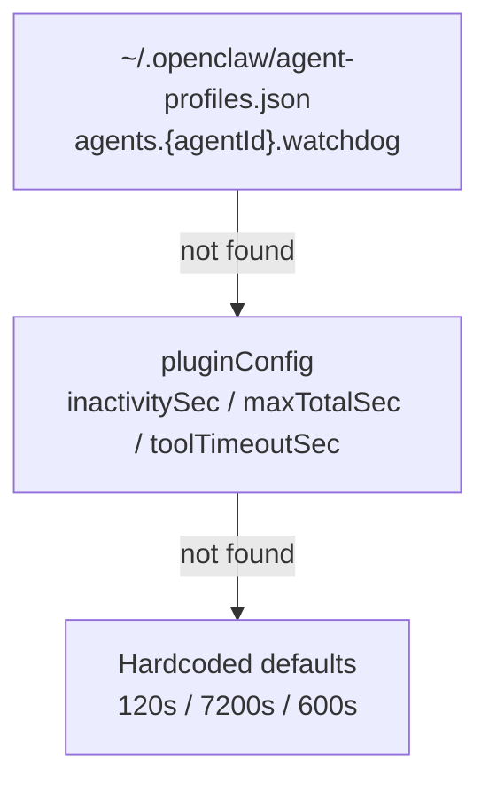

All config values are in **seconds**. The resolver converts to ms internally.

---

## Dispatch State (`dispatch-state.ts`)

File-backed persistent state at `~/.openclaw/linear-dispatch-state.json`:

```json
{
  "dispatches": {
    "active": { "API-123": { "status": "working", "attempt": 0, ... } },
    "completed": [ { "identifier": "API-122", "status": "done", ... } ]
  },
  "sessionMap": { "linear-worker-API-123-0": { "dispatchId": "API-123", "phase": "worker" } },
  "processedEvents": ["worker-end:...", "audit-end:..."]
}
```

### Atomic Operations

- **File locking**: exclusive lock before read-modify-write (30s stale threshold)
- **CAS transitions**: `transitionDispatch(id, expectedStatus, newStatus)` throws `TransitionError` on mismatch
- **Session mapping**: maps worker/audit session keys to dispatch context for `agent_end` hook lookup
- **Event dedup**: `markEventProcessed()` -- trimmed to last 200 entries

### Background Monitor (`dispatch-service.ts`)

Runs on 5-minute tick (zero LLM tokens):
1. **Stale detection**: marks dispatches inactive >2h as `stuck`
2. **Recovery**: finds dispatches with worker complete but audit missing
3. **Pruning**: removes completed entries older than 7 days

---

## Artifact System (`artifacts.ts`)

Per-worktree `.claw/` directory (gitignored):

| File | Content |
|------|---------|
| `manifest.json` | Issue metadata, tier, model, timestamps, status |
| `plan.md` | Implementation plan |
| `worker-{N}.md` | Worker output per attempt (truncated to 8KB) |
| `audit-{N}.json` | Audit verdict per attempt |
| `log.jsonl` | Append-only structured log (all phases including watchdog) |
| `summary.md` | Agent-curated final summary |

Summaries are also written to the orchestrator's `memory/` directory for long-term indexing.

---

## Project Planner Pipeline

Interactive planning mode for building Linear project issue hierarchies with dependency DAGs.

### State Machine

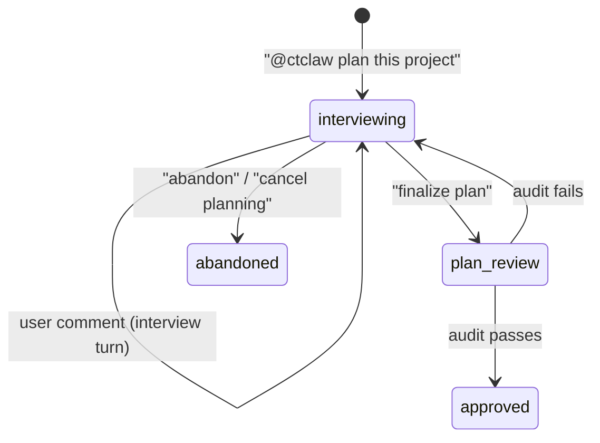

State lives in `~/.openclaw/linear-planning-state.json` (file-backed, same pattern as dispatch-state).

### Planning Flow

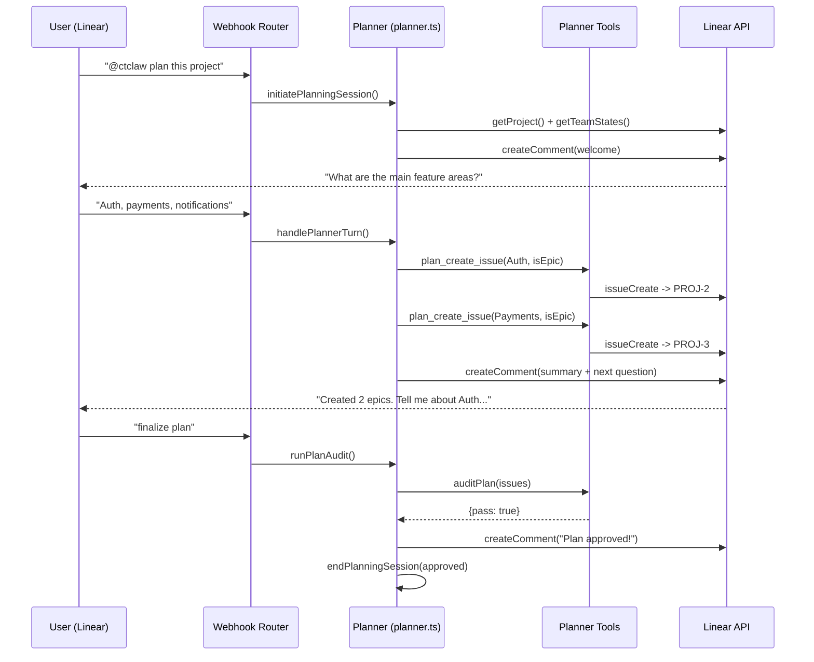

### Planner Tools (5 tools)

| Tool | Action |
|------|--------|
| `plan_create_issue` | Create issue/epic in project. Uses `GraphQL-Features: sub_issues` header for sub-issues. |
| `plan_link_issues` | Create `blocks`/`blocked_by`/`related` relations between issues |
| `plan_get_project` | Formatted tree snapshot of all project issues with relations |
| `plan_update_issue` | Update description, estimate, priority, labels on existing issue |
| `plan_audit` | Deterministic completeness audit (no LLM): descriptions, estimates, priorities, DAG cycles, orphans |

Tools use context injection (`setActivePlannerContext`/`clearActivePlannerContext`) -- set before `runAgent()`, cleared after. Same pattern as `active-session.ts`.

### DAG Audit Checks

The `auditPlan()` function is pure/deterministic (no LLM call):

1. All issues have descriptions >= 50 chars
2. Non-epic issues have estimates (not null)
3. Non-epic issues have priority > 0
4. No cycles in the dependency graph (Kahn's algorithm on blocks/blocked_by)
5. No orphan issues (everything has a parent or relation link)

### Dispatch Collision Prevention

While a project is in planning mode, the dispatch pipeline skips issues in that project. A comment explains: "This project is in planning mode. Finalize the plan before dispatching implementation."

## DAG Dispatch (`dag-dispatch.ts`)

After a project plan is approved, the DAG dispatcher walks the issue dependency graph in topological order. Leaf issues (no blockers) dispatch first; as each completes, its dependents become eligible.

### State Machine

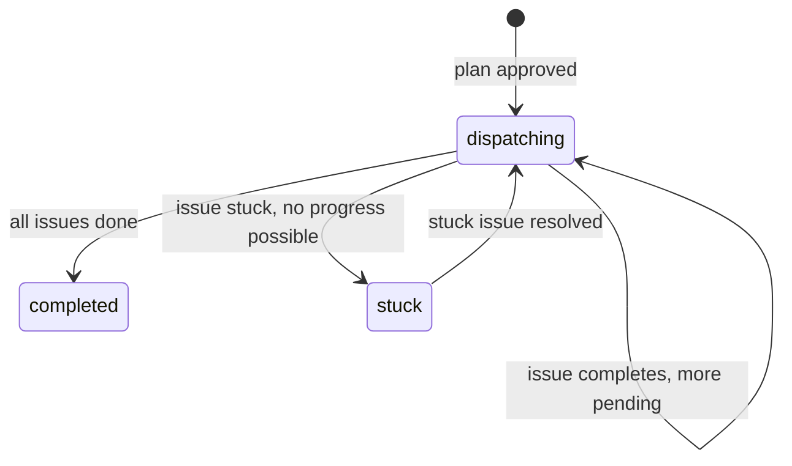

### Issue-Level Status

| Status | Meaning |
|--------|---------|
| `pending` | Blocked by dependencies |
| `dispatched` | Sent to worker-audit pipeline |
| `done` | Passed audit |
| `stuck` | Failed audit or watchdog killed |
| `skipped` | Epic (organizational only, not dispatched) |

### Cascade Logic

- `onProjectIssueCompleted(projectId, identifier)` — marks issue done, dispatches newly-unblocked dependents, checks if project is complete
- `onProjectIssueStuck(projectId, identifier)` — marks issue stuck, checks if project has no remaining progress path
- State persists in `planning-state.json` alongside planning sessions

---

## @Mention Routing

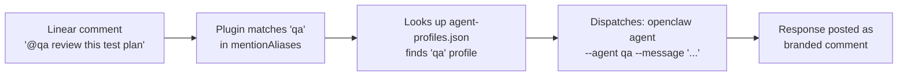

---

## Coding Tool Backends

The unified `code_run` tool dispatches to a configured CLI backend:

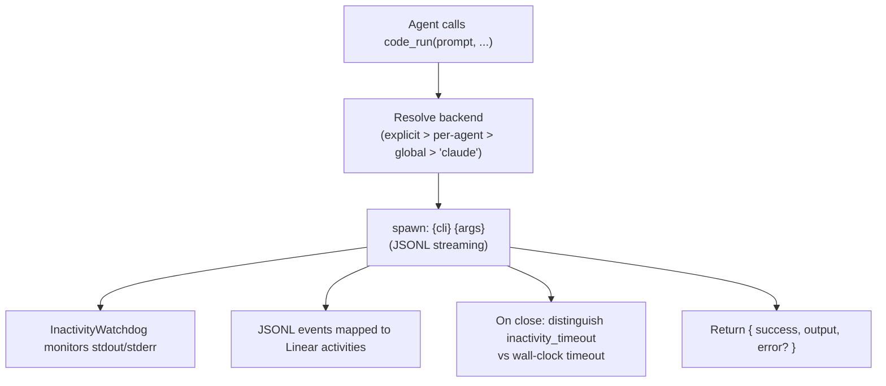

Backend-specific error types:
- `"timeout"` -- wall-clock timeout reached
- `"inactivity_timeout"` -- watchdog killed (no I/O)
- `"exit N"` -- CLI exited with non-zero code

---

## Agent Orchestration

| Tool | Behavior | Use Case |
|------|----------|----------|
| `spawn_agent` | Fire-and-forget | Parallel sub-tasks |
| `ask_agent` | Synchronous wait | Blocking questions |

Both use `runAgent()` under the hood.

---

## Token Resolution

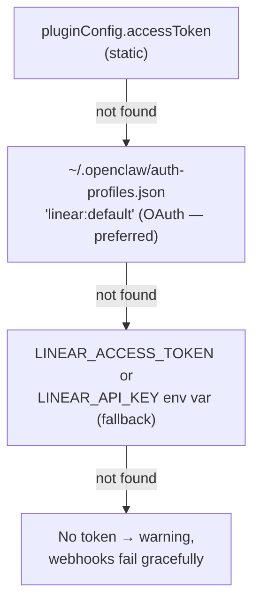

OAuth tokens auto-refresh 60s before expiry. On 401, forces refresh and retries once.

**Auth header:** OAuth tokens use `Bearer` prefix; personal API keys do not.

---

## Multi-Repo Dispatch

Issues that span multiple repositories use a three-tier resolution strategy to determine which repos to check out. The `resolveRepos()` function in `src/infra/multi-repo.ts` evaluates sources in priority order and returns the first match.

### Resolution Tiers

1. **Issue body markers** -- HTML comments `<!-- repos: api, frontend -->` or bracket syntax `[repos: api, frontend]` embedded in the Linear issue description. Parsed via regex.
2. **Linear labels** -- Labels prefixed with `repo:` (e.g. `repo:api`, `repo:frontend`). Multiple labels yield multiple repos.
3. **Config default** -- Falls back to the single `codexBaseRepo` path from plugin config (default: `/home/claw/ai-workspace`).

Repo names are mapped to filesystem paths via `pluginConfig.repos` (a `Record<string, string>`). Unknown names fall back to a convention: `{dirname(codexBaseRepo)}/{name}`.

### Multi-Worktree Layout

`createMultiWorktree()` (in `codex-worktree.ts`) creates parallel worktrees under a shared parent directory:

```
{baseDir}/{issueIdentifier}/
  api/          <-- worktree for repo "api"
  frontend/     <-- worktree for repo "frontend"
```

Each worktree uses the same branch name (`codex/{identifier}`) and follows the same idempotent/resume logic as single-repo worktrees. If the worktree directory already exists and is a valid git worktree, it is resumed rather than recreated.

### Prompt Rendering

When a dispatch targets multiple repos, the pipeline renders `{{worktreePath}}` as a multi-line list of repo-to-path mappings:

```
api: /home/claw/.openclaw/worktrees/CT-123/api
frontend: /home/claw/.openclaw/worktrees/CT-123/frontend
```

This applies to both worker and audit prompts.

### Resolution Flow

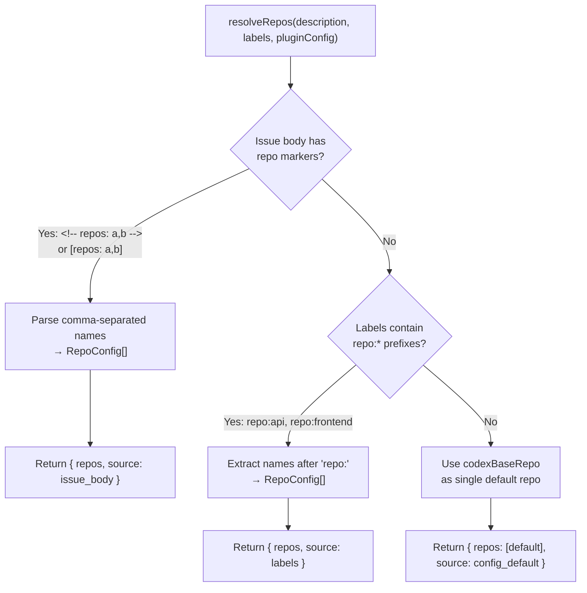

---

## Gateway RPC Methods

Six RPC methods are registered on the OpenClaw gateway via `api.registerGatewayMethod()` in `src/gateway/dispatch-methods.ts`. These allow external clients (UI, CLI, other plugins) to inspect and manage the dispatch pipeline through the standard gateway request/respond protocol.

| Method | Description |
|--------|-------------|
| `dispatch.list` | List active and completed dispatches. Accepts optional `status` and `tier` filter params. |
| `dispatch.get` | Full details for a single dispatch by `identifier`. Searches active first, then completed. |
| `dispatch.retry` | Re-dispatch a stuck issue. Removes the active dispatch, re-registers it as `dispatched` with incremented attempt counter. Only valid for `stuck` dispatches. |
| `dispatch.escalate` | Force a `working` or `auditing` dispatch into `stuck` status. Accepts an optional `reason` param (defaults to "Manually escalated via gateway"). Uses CAS transition. |
| `dispatch.cancel` | Remove an active dispatch entirely, regardless of current status. |
| `dispatch.stats` | Aggregate counts broken down by status and tier, plus total active/completed counts. |

All methods return `{ ok: true, ...data }` on success or `{ ok: false, error: "..." }` on failure. CAS transition conflicts on `dispatch.escalate` are caught and returned as structured errors.

---

## Observability / Diagnostics

`emitDiagnostic()` in `src/infra/observability.ts` emits structured JSON log lines via `api.logger.info()`. Each line is prefixed with `[linear:diagnostic]` so log aggregators and monitoring tools can parse them for dashboards and alerting.

### Event Types

| Event | Emitted When |
|-------|-------------|
| `webhook_received` | Incoming webhook event processed by the router |
| `dispatch_started` | New dispatch registered and worker about to start |
| `phase_transition` | Dispatch moves between pipeline phases (e.g. `working` -> `auditing`) |
| `audit_triggered` | Audit agent spawned after worker completion |
| `verdict_processed` | Audit verdict parsed and acted upon (pass, fail, or stuck) |
| `watchdog_kill` | Inactivity watchdog killed an agent process |
| `notify_sent` | Notification delivered successfully to a channel |
| `notify_failed` | Notification delivery failed |
| `health_check` | Periodic health check result |

### Payload Structure

All events share a common `DiagnosticPayload` interface with an `event` discriminator and optional context fields:

```json
{
  "event": "phase_transition",
  "identifier": "CT-123",
  "phase": "auditing",
  "from": "working",
  "to": "auditing",
  "attempt": 1,
  "tier": "medior",
  "durationMs": 45200
}
```

Common fields: `identifier`, `issueId`, `phase`, `from`, `to`, `attempt`, `tier`, `webhookType`, `webhookAction`, `channel`, `target`, `error`, `durationMs`. Additional arbitrary keys are allowed via the index signature.

The function is wrapped in a try/catch that silently swallows serialization errors -- telemetry must never throw.

---

## Three-Layer Prompt Merge

Prompt templates are loaded via a three-layer merge strategy in `src/pipeline/pipeline.ts`. Each layer can override individual fields within a section (worker, audit, rework) but does not deep-merge within those fields.

### Layers

| Layer | Source | Scope |
|-------|--------|-------|
| **1. DEFAULT_PROMPTS** | Hardcoded in `pipeline.ts` | Built-in fallback for all sections (worker.system, worker.task, audit.system, audit.task, rework.addendum) |
| **2. Global YAML** | `pluginConfig.promptsPath` or sidecar `prompts.yaml` shipped with the plugin | Overrides defaults for all dispatches. Loaded via `loadRawPromptYaml()` and parsed with the `yaml` package. |
| **3. Per-project YAML** | `{worktreePath}/.claw/prompts.yaml` | Overrides global prompts for a specific project/worktree only |

### Merge Strategy

Section-level shallow merge via `mergePromptLayers()`:
- Each section (`worker`, `audit`, `rework`) is spread independently: `{ ...base.worker, ...overlay.worker }`
- If an overlay provides `worker.task` but not `worker.system`, only `task` is replaced; `system` retains the value from the previous layer
- No recursive deep merge -- the overlay replaces fields at one level below the section

### Caching

- **Global cache**: `_cachedGlobalPrompts` -- loaded once (layers 1 + 2 merged), reused across all dispatches
- **Per-worktree cache**: `_projectPromptCache` -- keyed by worktree path, stores the fully merged result (layers 1 + 2 + 3)
- `clearPromptCache()` resets both caches (used in tests and after config changes)

### Merge Flow

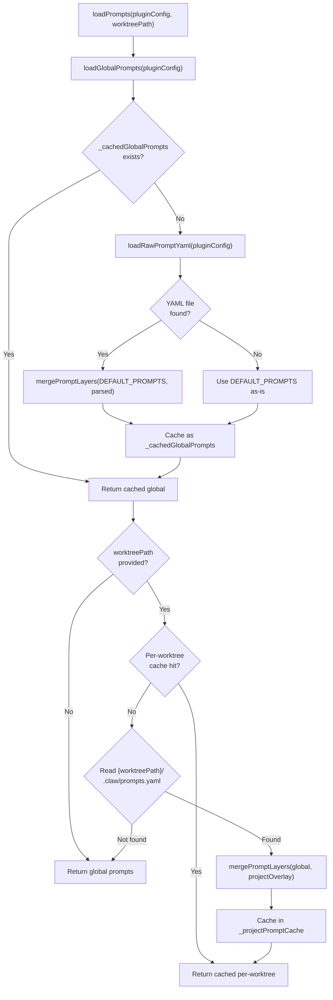

---

## Dispatch Slash Commands

The `/dispatch` command is registered in `src/infra/commands.ts` via `api.registerCommand()`. It provides a zero-LLM interface for managing dispatches -- all subcommands execute directly against the dispatch state file without invoking an AI agent.

### Subcommands

| Subcommand | Usage | Behavior |
|------------|-------|----------|
| `list` | `/dispatch list` | Show all active dispatches with status, tier, attempt, and age in minutes |
| `status` | `/dispatch status <id>` | Full details for a single dispatch: status, tier, attempt, age, worktree path, stuck reason, session ID. Also checks completed dispatches. |
| `retry` | `/dispatch retry <id>` | Reset a `stuck` dispatch back to `dispatched`. Removes and re-registers with reset status fields and fresh timestamp. |
| `escalate` | `/dispatch escalate <id> [reason]` | Force a non-terminal dispatch into `stuck` status via CAS transition. Optional reason text (defaults to "manual escalation"). |

Running `/dispatch` with no subcommand or an unrecognized subcommand prints the help text listing all available subcommands.

The retry and escalate subcommands use the same state operations as the gateway RPC methods (`removeActiveDispatch` + `registerDispatch` for retry, `transitionDispatch` for escalate) and log actions via `api.logger`.

---

## Dispatch History Tool

The `dispatch_history` tool (registered in `src/tools/dispatch-history-tool.ts`) gives agents the ability to search past and active dispatches for context about related work.

### Parameters

| Parameter | Type | Description |
|-----------|------|-------------|
| `query` | string | Issue identifier (e.g. `CT-123`) or keyword to search in summaries |
| `tier` | enum | Filter by tier: `junior`, `medior`, `senior` |
| `status` | enum | Filter by status: `dispatched`, `working`, `auditing`, `done`, `failed`, `stuck` |
| `limit` | number | Max results to return (default: 10) |

### Search Strategy

The tool searches two data sources in order:

1. **Active dispatches** -- reads `dispatch-state.json`, filters active entries by query/tier/status
2. **Completed dispatches** -- scans the completed section of dispatch state
3. **Memory files** -- reads `dispatch-*.md` files from the orchestrator's `memory/` directory. Enriches results already found with summary excerpts, and discovers additional dispatches that match the query keyword in their content.

Memory files are expected to have YAML frontmatter with `tier`, `status`, and `attempts` fields. The `extractSummaryExcerpt()` function returns up to 200 characters of context around the query match.

### Result Format

Each result includes: `identifier`, `tier`, `status`, `attempts`, `summary` (excerpt), and `active` (boolean). Active dispatches are tagged with `[ACTIVE]` in the formatted output.

---

## File Structure

```
linear/
|-- index.ts                  Entry point -- routes, tools, CLI, hooks, narration guard
|-- openclaw.plugin.json      Plugin metadata and config schema
|-- package.json
|-- prompts.yaml              Externalized prompt templates
|-- coding-tools.json         Backend configuration
|-- README.md
|-- docs/
|   |-- architecture.md       This file
|   +-- troubleshooting.md    Diagnostic commands and common issues
+-- src/
    |-- pipeline/              Core dispatch lifecycle
    |   |-- webhook.ts             Event router (6 handlers, dedup, dispatch)
    |   |-- pipeline.ts            v2 pipeline: spawnWorker, triggerAudit, processVerdict
    |   |-- dispatch-state.ts      File-backed state, CAS, session map, idempotency
    |   |-- dispatch-service.ts    Background monitor (stale, recovery, prune)
    |   |-- active-session.ts      In-memory session registry
    |   |-- tier-assess.ts         Complexity assessment (junior/medior/senior)
    |   |-- artifacts.ts           .claw/ directory artifacts + memory integration
    |   |-- planner.ts             Project planner orchestration (interview, audit)
    |   |-- planning-state.ts      File-backed planning state (mirrors dispatch-state)
    |   +-- dag-dispatch.ts        DAG-based project dispatch (topological ordering)
    |
    |-- agent/                 Agent execution & monitoring
    |   |-- agent.ts               Embedded runner + subprocess, watchdog + retry
    |   +-- watchdog.ts            InactivityWatchdog class + config resolver
    |
    |-- tools/                 Tool registration & CLI backends
    |   |-- tools.ts               Tool registration (code_run + orchestration)
    |   |-- code-tool.ts           Unified code_run dispatcher
    |   |-- cli-shared.ts          Shared CLI helpers and defaults
    |   |-- claude-tool.ts         Claude Code runner (JSONL + watchdog)
    |   |-- codex-tool.ts          Codex runner (JSONL + watchdog)
    |   |-- gemini-tool.ts         Gemini runner (JSONL + watchdog)
    |   |-- orchestration-tools.ts spawn_agent / ask_agent
    |   |-- planner-tools.ts       5 planning tools + DAG audit + snapshot formatter
    |   +-- dispatch-history-tool.ts  dispatch_history search tool (state + memory)
    |
    |-- gateway/               Gateway RPC methods
    |   +-- dispatch-methods.ts    6 RPC methods for dispatch management
    |
    |-- api/                   Linear API & auth
    |   |-- linear-api.ts          GraphQL client, token resolution, auto-refresh
    |   |-- auth.ts                OAuth provider registration
    |   +-- oauth-callback.ts      OAuth callback handler
    |
    |-- infra/                 Infrastructure utilities
    |   |-- cli.ts                 CLI subcommands
    |   |-- codex-worktree.ts      Git worktree management
    |   |-- notify.ts              Multi-channel notifier (Discord, Slack, Telegram, Signal)
    |   |-- commands.ts            Zero-LLM slash commands for dispatch operations
    |   |-- doctor.ts              Health check system (auth, config, connectivity, dispatch)
    |   |-- file-lock.ts           Exclusive file locking for state files
    |   |-- multi-repo.ts          Multi-repo resolution (issue body, labels, config)
    |   |-- observability.ts       Structured diagnostic event logging
    |   +-- resilience.ts          Retry with exponential backoff + circuit breaker
    |
    |-- __test__/              Shared test infrastructure
    |   |-- helpers.ts             Mock factories (API, Linear, HookContext, temp paths)
    |   +-- fixtures/
    |       |-- webhook-payloads.ts    Linear webhook event factories
    |       +-- linear-responses.ts    GraphQL response factories
    |
    +-- scripts/
        +-- uat-linear.ts         Live integration tests against real Linear workspace
```

---

## Testing Infrastructure

319 tests across 20 files (~10s runtime).

### Test Layers

| Layer | What's mocked | What runs for real |
|-------|--------------|-------------------|
| **Unit tests** | All imports via `vi.mock` | Single module under test |
| **E2E tests** | External boundaries only (runAgent, Linear API, codex-worktree) | Full pipeline chain with file-backed state |
| **UAT** | Nothing | Full stack against real Linear workspace |

### Shared Helpers (`src/__test__/`)

- `helpers.ts` — `createMockApi()`, `createMockLinearApi()`, `createMockHookCtx()`, `tmpStatePath()`
- `fixtures/webhook-payloads.ts` — Factory functions for all Linear webhook event types
- `fixtures/linear-responses.ts` — Factory functions for GraphQL response shapes

### Running Tests

```bash
npx vitest run                    # All tests
npx vitest run --coverage         # With coverage report
npx tsx scripts/uat-linear.ts     # Live UAT (requires gateway + tunnel)
```
